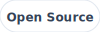

# readme-kit

Component-based READMEs—like shadcn, but for your README. Install components from the CLI, write a template, run build. Output works on GitHub (SVGs as images).

## Install

```sh
npm install readme-kit --SD
```

In your repo (e.g. your GitHub profile repo):

```sh
# Creates .readme-kit folder in your project
npx readme-kit init

# Adds component
npx readme-kit add <component-name>
```

The idea is that you can create your own components in .readme-kit/components and they will work with your setup, you just have to refer to them as file's name.
Also you can modify preinstalled components

```sh
# To build README.md use:
npm run build
```

## How it works

Important: you have to create README.template.md and basically the package designed to modify only this file and do not touch README.md itself.

- Placeholders like `<!-- component name key=value -->` are replaced at build time.
- Components are Handlebars templates; SVG output is written to readme-assets/ and inlined as  so GitHub renders them.
- Icons come from the simple-icons package (installed with the project).

[](https://www.typescriptlang.org)





